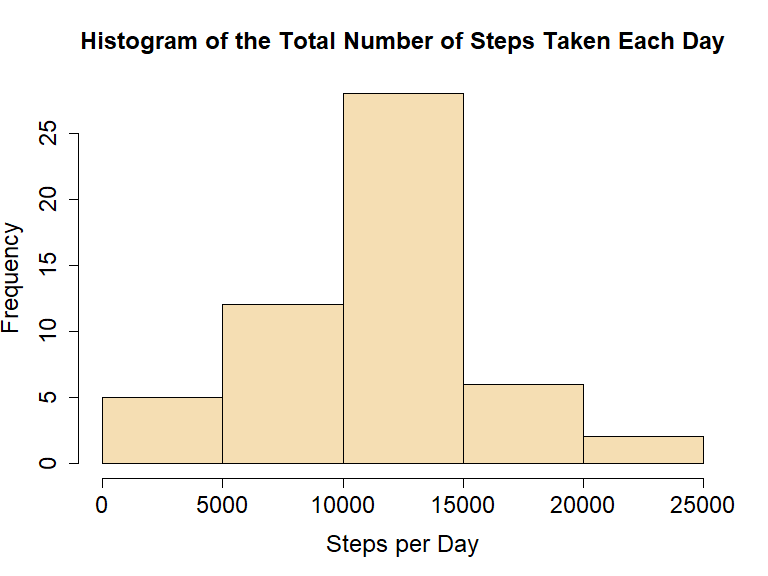
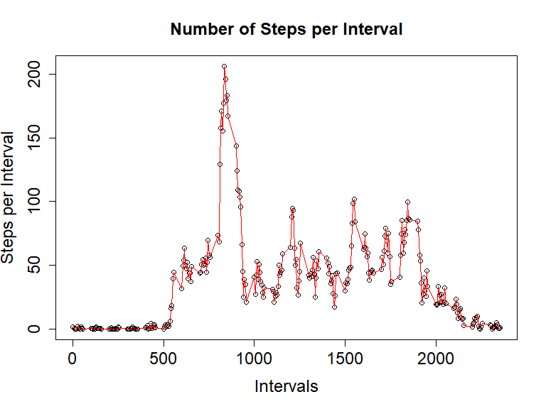
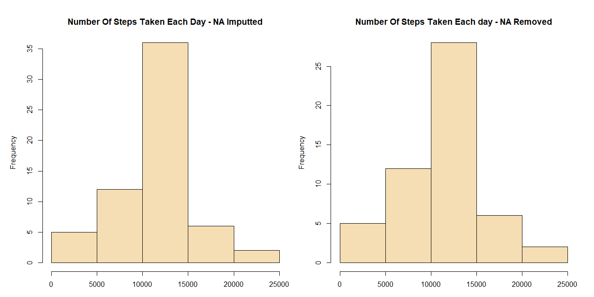
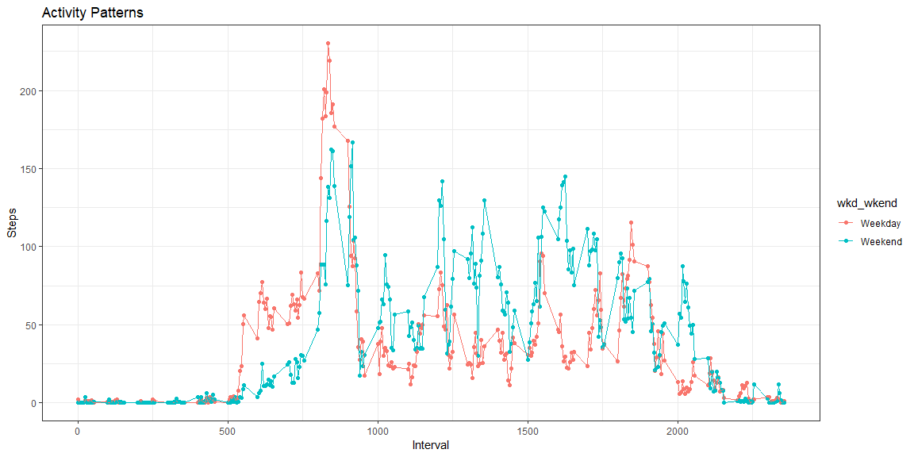

1. Introduction
---------------

Thanks to activity monitoring devices (e.g., Fitbit, Nike Fuelband or
Jawbone Up) that have now made possible gathering huge amount of
personal movement data. Such data can be used to study the health status
and behavioral patterns of individuals, which in turn is important to
prescribe protective measures for achieving a healthy society. Advances
in statistical methods and software for processing and interpreting data
have also opened opportunities to use such data sources easily.

This exercise makes use of data from a personal activity monitoring
device, a FitBit. This device collects data at 5 minute intervals
through out the day. The collection consists of two months of data from
an anonymous individual gathered during the months of October and
November, 2012 and includes the number of steps taken in 5 minute
intervals each day.

The exercise involves loading and preprocessing of data, imputing
missing values in the data, conducting analysis and interpreting results
to answer a series of research questions.

2. Methods
----------

### 2.1. Data Overview

The data was obtained from *Activity Monitoring Data*
[link](https://d396qusza40orc.cloudfront.net/repdata%2Fdata%2Factivity.zip),
and it encompasses the following variables:

-   steps: Number of steps taking in a 5-minute interval (missing values
    are coded as NA),
-   date: The date on which the measurement was taken in YYYY-MM-DD
    format, and
-   interval: Identifier for the 5-minute interval in which measurement
    was taken

### 2.2. Data Acquisition and Loading

This step requires setting of a working directory, installing required
packages, loading the data into a data frame and preprocessing the data
(if required) to a format suitable for the intended analysis.

#### *Setting a working directory*

    setwd("C:/Users/Administrator/Documents/DataScience/R/Reproducible_Research/PeerReview1")

#### *Loading required packages and libraries*

    library(ggplot2)           
    library(dplyr)
    library(chron)
    library(lattice) 
    library(xtable)

#### *Creating new data folder*

    if (!file.exists ("./Activity_Monitoring_Data2") ) {
    dir.create("./Activity_Monitoring_Data2")
    }

#### *Downloading data*

    datalink<-"https://d396qusza40orc.cloudfront.net/repdata%2Fdata%2Factivity.zip"
    download.file(datalink, destfile ="./Activity_Monitoring_Data2/repdata_data_activity.zip") 

#### *Loading data*

    unzip("./Activity_Monitoring_Data2/repdata_data_activity.zip", exdir = "./Activity_Monitoring_Data2")

    fitBitD<- read.csv("./Activity_Monitoring_Data2/activity.csv", header = TRUE)

### 2.3. Preprocess the data

#### *Inspecting the data*

    head(fitBitD)

    ##   steps       date interval
    ## 1    NA 2012-10-01        0
    ## 2    NA 2012-10-01        5
    ## 3    NA 2012-10-01       10
    ## 4    NA 2012-10-01       15
    ## 5    NA 2012-10-01       20
    ## 6    NA 2012-10-01       25

    summary(fitBitD)

    ##      steps                date          interval     
    ##  Min.   :  0.00   2012-10-01:  288   Min.   :   0.0  
    ##  1st Qu.:  0.00   2012-10-02:  288   1st Qu.: 588.8  
    ##  Median :  0.00   2012-10-03:  288   Median :1177.5  
    ##  Mean   : 37.38   2012-10-04:  288   Mean   :1177.5  
    ##  3rd Qu.: 12.00   2012-10-05:  288   3rd Qu.:1766.2  
    ##  Max.   :806.00   2012-10-06:  288   Max.   :2355.0  
    ##  NA's   :2304     (Other)   :15840

    str(fitBitD)

    ## 'data.frame':    17568 obs. of  3 variables:
    ##  $ steps   : int  NA NA NA NA NA NA NA NA NA NA ...
    ##  $ date    : Factor w/ 61 levels "2012-10-01","2012-10-02",..: 1 1 1 1 1 1 1 1 1 1 ...
    ##  $ interval: int  0 5 10 15 20 25 30 35 40 45 ...

The data has 17568 rows and 3 columns.

#### *Change date format into date*

    fitBitD$date<-as.Date(fitBitD$date)
    head(fitBitD)

    ##   steps       date interval
    ## 1    NA 2012-10-01        0
    ## 2    NA 2012-10-01        5
    ## 3    NA 2012-10-01       10
    ## 4    NA 2012-10-01       15
    ## 5    NA 2012-10-01       20
    ## 6    NA 2012-10-01       25

#### *Aggregating (summation) of steps over date*

This aggregation was done to calculate the total number of steps taken
per day by ignoring the missing values in the dataset.

    fitBitD.sumSteps<- aggregate(steps ~ date, fitBitD, FUN=sum, na.rm=TRUE)

    head(fitBitD.sumSteps)

    ##         date steps
    ## 1 2012-10-02   126
    ## 2 2012-10-03 11352
    ## 3 2012-10-04 12116
    ## 4 2012-10-05 13294
    ## 5 2012-10-06 15420
    ## 6 2012-10-07 11015

#### *Aggregating (average) of steps over date*

    fitBitD.meanSteps<- aggregate(steps ~ date, fitBitD, FUN=mean)

    head(fitBitD.meanSteps)

    ##         date    steps
    ## 1 2012-10-02  0.43750
    ## 2 2012-10-03 39.41667
    ## 3 2012-10-04 42.06944
    ## 4 2012-10-05 46.15972
    ## 5 2012-10-06 53.54167
    ## 6 2012-10-07 38.24653

#### *Aggregating (average) of steps over interval*

    fitBitD.meanIntrvalSteps <- aggregate(steps ~ interval, fitBitD, FUN=mean, na.rm=T)

    head(fitBitD.meanIntrvalSteps)

    ##   interval     steps
    ## 1        0 1.7169811
    ## 2        5 0.3396226
    ## 3       10 0.1320755
    ## 4       15 0.1509434
    ## 5       20 0.0754717
    ## 6       25 2.0943396

#### *Calculating and reporting the total number of missing values in the dataset*

    missing<-sum(is.na(fitBitD))

    missing

    ## [1] 2304

There are 2304 missing values (coded as NA) in the data-set. The
presence of missing values may introduce bias into some calculations or
summaries of the data and needs to be inputed using the average values
over date.

#### *Imputing missing values and creating a new data-set with the missing data filled in*

    fitBitD.fill_na<- transform(fitBitD, steps = ifelse(is.na(fitBitD$steps), fitBitD.meanIntrvalSteps$steps[match(fitBitD$interval, fitBitD.meanIntrvalSteps$interval)], fitBitD$steps)) 

    head(fitBitD.fill_na)

    ##       steps       date interval
    ## 1 1.7169811 2012-10-01        0
    ## 2 0.3396226 2012-10-01        5
    ## 3 0.1320755 2012-10-01       10
    ## 4 0.1509434 2012-10-01       15
    ## 5 0.0754717 2012-10-01       20
    ## 6 2.0943396 2012-10-01       25

    tail(fitBitD.fill_na)

    ##           steps       date interval
    ## 17563 2.6037736 2012-11-30     2330
    ## 17564 4.6981132 2012-11-30     2335
    ## 17565 3.3018868 2012-11-30     2340
    ## 17566 0.6415094 2012-11-30     2345
    ## 17567 0.2264151 2012-11-30     2350
    ## 17568 1.0754717 2012-11-30     2355

3. Results
----------

### What is mean total number of steps taken per day?

For this part of the assignment, you can ignore the missing values in
the data-set to calculate the total number of steps taken per day and
make its histogram. See the aggregation (summation) of steps over date
part of the preprocessing section above.

#### *Ploting histogram using hist() from base plotting*

    hist(fitBitD.sumSteps$steps, 
         col="wheat", 
         ylab = "Frequency", 
         xlab = "Steps per Day",
         main = "Histogram of the Total Number of Steps Taken Each Day",
         cex.lab=1.5, cex.axis=1.5, cex.main=1.5, cex.sub=1.5)

#### *Mean and median number of steps taken each day*

    #Calculating mean
    stepsMean <- mean(fitBitD.sumSteps$steps) 
    stepsMean

    ## [1] 10766.19

    #Calculating median
    stepsMedian <- median(fitBitD.sumSteps$steps) 
    stepsMedian

    ## [1] 10765

The mean and the median number of steps taken each day are 10766 and
10765 respectively.

### *What is the average daily activity pattern?*

#### *Aggregating (average) of steps over date*

To answer this question the *fitBitD.meanSteps* data generated in the
preprocessing section (see Aggregating (average) of steps over interval)
above.

#### *Time series plot of the average number of steps taken per interval*

    plot(fitBitD.meanIntrvalSteps$interval, fitBitD.meanIntrvalSteps$steps, data= fitBitD.meanIntrvalSteps, xlab= "Intervals", ylab ="Steps per Interval", main ="Number of Steps per Interval", cex.lab=1.5, cex.axis=1.5, cex.main=1.5, cex.sub=1.5)
    lines(fitBitD.meanIntrvalSteps$interval, fitBitD.meanIntrvalSteps$steps, data=fitBitD.meanIntrvalSteps, col ="red")

#### *The 5-minute interval that, on average, contains the maximum number of steps*

    #Calculating mean

    max.fitBitD.meanIntrvalSteps <-  fitBitD.meanIntrvalSteps$interval[which.max(fitBitD.meanIntrvalSteps$steps)]
    maxSteps<-max(fitBitD.meanIntrvalSteps$steps)
    maxSteps

    ## [1] 206.1698

    max.fitBitD.meanIntrvalSteps 

    ## [1] 835

The 835th interval on average contains the maximum number of 206 steps.

#### *Show how imputting changes the outcomes of previous analysis*

#### *Make a histogram of the total number of steps taken each day using imputted data-sets*

    fitBitD.sumSteps_fillna<- aggregate(steps ~ date, fitBitD.fill_na, FUN=sum, na.rm=TRUE)

    par(mfrow =c(1,2), mar= c(2, 4, 3, 1), oma = c(1,1,1,1))
    #Ploting histogram using hist() from Base Plotting
    hist(fitBitD.sumSteps_fillna$steps, 
         col="wheat", 
         ylab = "Frequency", 
         xlab = "Steps per Day",
         main = "Number Of Steps Taken Each Day - NA Imputted")

    #Ploting histogram using hist() from Base Plotting
    hist(fitBitD.sumSteps$steps, 
         col="wheat", 
         ylab = "Frequency", 
         xlab = "Steps per Day",
         main = "Number Of Steps Taken Each day - NA Removed")

#### *Calculate and report the mean and median total number of steps taken per day*

The mean and median of the total number of steps taken per day were
previously calculated as 10766 and 10765respectively for NA removed
data-set.

The mean and median of the NA imputted data-set were also calculated
below. Using the \#xtable\# package, Table 1 to depict the statistics
calculated from both data-sets.

    # Calculating mean and formating the result
    stepsMean_imputted <- format(mean(fitBitD.sumSteps_fillna$steps), digits=1) 

    # Calculating median
    stepsMedian_imputted <- format(median(fitBitD.sumSteps_fillna$steps), digit=1) 

    # Store the results in a dataframe
    stepsMean_Median <- data.frame(c(format(stepsMean, digits=1), format(stepsMedian, digits=1)), c(stepsMean_imputted, stepsMedian_imputted))
    colnames(stepsMean_Median) <- c("NA Removed", "NA Imputed")
    rownames(stepsMean_Median) <- c("mean", "median")

    stepsMean_Median

    ##        NA Removed NA Imputed
    ## mean        10766      10766
    ## median      10765      10766

#### *Do mean and median values differ from the estimates from the first part of the assignment?*

As shown in above table, imputing missing values didn't change the mean
value while there is a negligible change with the median value which
increased only by 1 for the imputted data-set.

#### *What is the impact of imputing missing data on the estimates of the total daily number of steps?*

Classes between 10000 and 15000 steps revealed higher frequencies in
histograms with imputted data. However, the pattern in both histograms
is the same.

#### *Are there differences in activity patterns between weekdays and weekends?*

    weekend_days_set<-c("Saturday", "Sunday")

    fitBitD.fill_na$wkd_wkend<-factor(ifelse(is.element(weekdays(as.Date(fitBitD.fill_na$date)),weekend_days_set), "Weekend", "Weekday"))

    head(fitBitD.fill_na)

    ##       steps       date interval wkd_wkend
    ## 1 1.7169811 2012-10-01        0   Weekday
    ## 2 0.3396226 2012-10-01        5   Weekday
    ## 3 0.1320755 2012-10-01       10   Weekday
    ## 4 0.1509434 2012-10-01       15   Weekday
    ## 5 0.0754717 2012-10-01       20   Weekday
    ## 6 2.0943396 2012-10-01       25   Weekday

    tail(fitBitD.fill_na)

    ##           steps       date interval wkd_wkend
    ## 17563 2.6037736 2012-11-30     2330   Weekday
    ## 17564 4.6981132 2012-11-30     2335   Weekday
    ## 17565 3.3018868 2012-11-30     2340   Weekday
    ## 17566 0.6415094 2012-11-30     2345   Weekday
    ## 17567 0.2264151 2012-11-30     2350   Weekday
    ## 17568 1.0754717 2012-11-30     2355   Weekday

    dfill_na_wdwkd_avg <- aggregate(steps ~ interval + wkd_wkend, fitBitD.fill_na, mean)

    head(dfill_na_wdwkd_avg)

    ##   interval wkd_wkend      steps
    ## 1        0   Weekday 2.25115304
    ## 2        5   Weekday 0.44528302
    ## 3       10   Weekday 0.17316562
    ## 4       15   Weekday 0.19790356
    ## 5       20   Weekday 0.09895178
    ## 6       25   Weekday 1.59035639

    qplot(interval, steps, data=dfill_na_wdwkd_avg, col = wkd_wkend, geom = c("point", "line")) + theme_bw() + labs(x = "Interval", y = "Steps", title = "Activity Patterns")

4. Conclusion
-------------

For this data set, imputting doesn't appear to change the mean and
median statistics that much. And, there seems to be a variation in
temporal pattern of tested patterns during weekdays and weekends. Tested
subjects seems to have an earlier start in weekdays peaking (i.e,
betweeen 8am and 9am) while they appears to be more spread between 8am
and 8pm on weekend days.
